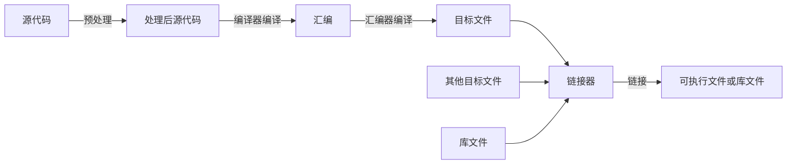

## 什么是CMake

CMake 是一个跨平台的开源构建工具，用于自动化编译、测试和安装软件项目。

在C/C++构建过程中，我们知道必须要有一个编译器。但在实际应用中，除了编译器之外，我们往往还需要构建工具，甚至元构建工具来构建我们的项目。

要了解这些概念我们首先需要了解C/C++语言的编译过程。

### C/C++的编译过程

C/C++的编译过程通常如下：



#### 预处理

预处理阶段会展开所有的宏，将头文件粘贴到`include`语句位置。

以GCC编译器为例，预处理的命令为

```bash
gcc -E input.c -o output.i
```

#### 编译

经预处理的源代码会被编译器编译成汇编语言。汇编语言经汇编器生成目标文件。

现在市面上主流的编译器有三个，GCC, Clang, MSVC。

其中我们最常用的是GCC，其原本用于linux系统，移植到到Windows上则是MinGW。MSVC是微软开发的编译器，仅用于Windows系统，也就是Visual Studio使用的编译器。Clang是LLVM项目的编译器，最初用于Mac OS X，现已移植到Windows和Linux上。

以GCC编译器为例，生成目标文件的命令为

```bash
gcc -c input.c -o output.o
```

Linux系统下的目标文件后缀为`.o`，Windows系统下的目标文件后缀为`.obj`。

#### 链接

原则上我们需要单独编译每一个源文件，并生成一个单独目标文件，这个过程中实际上是独立的，也就是说编译的过程中，各个源文件是感知不到其他源文件的。

我们通常在头文件声明变量、函数或类等，但是其定义可能分散在数个源文件中，那么每个源文件中的内容大概率是不完整的。比如在该源文件中调用的函数其定义在另一个源文件中，在编译时，只要有声明，编译器便不会报错，不会在意某个函数的定义是否存在。

链接器的作用就是将这些目标文件链接在一起，生成一个可执行文件或库文件。这个阶段，链接器会为各个目标文件中声明的变量、函数等等在所有目标文件中寻找定义，最终链接成一个完整的可执行文件或库文件。

以GCC编译器为例，链接几个目标文件的命令为

```bash
gcc a.o b.o -o c
```

通常我们想要编译几个源文件时，可以这样写命令

```bash
gcc a.c b.c c.c -o d
```

当项目非常小且没有什么依赖项时，这样似乎足够了。但是当项目变得比较庞大，我们要编译的源文件从几个变成几十个，要生成的东西从一个可执行文件变成数个库文件和数个可执行文件，那么一个一个敲命令来编译就显得效率很低而且易错、不易维护。

要解决这样的问题，很多人就会说了，写一个shell脚本不就好了。这正是下面一节要说的。

### 构建工具

什么是构建工具，构建工具是用于构建C/C++项目的工具（当然也可以是别的语言），运行一种特定的脚本文件来构建项目。

比如Linux上的make，通过运行Makefile来构建项目。我们只需要编写Makefile,而编写Makefile要比我们手写普通shell要方便得多，因为它有有更好的可拓展性、可维护性。

这就使得我们编译大型项目也能得心应手，只需要写好Makefile，后续构建只需要一行命令即可。

但是问题是，构建工具没有统一的标准，堪称百花齐放，各自与各自的平台深度绑定，往往互不兼容，导致难以迁移。

比如MSVC自带的构建系统NMake，仅在Windows下面可以用。

虽然也有像Ninja这样的跨平台构建系统，但还有一个问题是，这类脚本虽然比直接敲命令方便太多，但是也算不上好写，相当繁琐。

于是另一类工具诞生了，即下一节要介绍的元构建工具。

### 元构建工具

元构建工具是一种用于生成构建脚本或配置文件的工具，它位于构建系统的更高层次，用于自动化构建过程的配置和管理。

我们用元构建工具写一个配置文件，根据这个配置文件元构建工具可以生成指定构建工具的构建脚本再调用对应构建工具来构建项目。

使用元构建系统，配置可读性更高、更易维护，功能也更加强大。

当前主流的元构建工具便是CMake，当然也有其他一些元构建工具，比如xmake和bazel。但是目前CMake仍可以说是事实上的标准。使用的更广泛。

说了这么多，我们终于可以进入正题了，下面将介绍CMake的使用方法。

## CMake工作流

这一节将介绍使用CMake的工作流。

以我自己写的一个简单小项目[MineSweeper](https://github.com/ChillyWall/MineSweeper.git)为例子，读者可以将该项目clone下来，尝试根据下面的介绍将其编译出来。

如果读者要使用该项目，请先根据该项目中的README.md文件先安装依赖。

### 编写CMakeLists.txt

CMakeLists.txt是CMake的配置文件，这个名字是固定的，是CMake的配置文件，虽然后缀是txt但实际上是一个脚本，使用一个独立的语言（它甚至是图灵完备的）。

后文中会介绍这个文件如何写。现在我们在该项目的根目录中可以看到一个CMakeLists.txt文件。我们要通过它构建这个项目。

### 生成构建系统

接下来我们要做的是生成构建系统。即通过cmake生成指定的构建系统的配置文件。

CMake可以生成多种构建系统，构建工具在cmake中被称为生成器generator，在linux下默认的为`Unix Makefiles`。推荐使用`Ninja`，不过需要单独安装

命令格式为`cmake path`，path指我们最外层CMakeLists.txt所在的目录。这会在我们当前目录下输出生成的构建系统。一般不推荐在项目根目录直接运行这个命令，不然生成结果会与源码混合，不利于管理。我们一般专门创建一个文件夹用来放生成结果。一般命名为build或out。

我们可以通过参数`-B`指定输出目录，`-S`指定源代码目录。我们也可以通过`-G`指定生成器。

我们也可以传递一些cmake变量的值，比如后面部署安装这一步默认安装到系统全局中（linux下即`/usr``下面），如果我们不希望这样，而是希望安装到我们自己的用户目录下的`.local`下，我们可以传递`CMAKE_INSTALL_PREFIX`变量来实现。语法为在变量名前加`-D`（无空格），在后面加`=`后面跟变量值。

```bash
cmake -S . -B build -G Ninja -DCMAKE_INSTALL_PREFIX=/home/$USER/.local
```

执行完成之后，我们会在当前目录下看到一个`build`文件夹，里面就是cmake生成的构建系统。如果你使用的是`Unix Makefiles`, 那么你将在里面看到一个`Makefile`文件。如果你使用的是Ninja，就会在里面看到`build.ninja`文件。这些便是对应构建系统的构建脚本。

### 构建

之后的步骤就是调用构建工具来构建项目了。一般需要配置的在此之前都已完成，我们只需要运行

```bash
cmake --build build
```

`--build`后面跟的是我们在上一步中指定的输出目录。

你也可以调用对应构建系统的构建工具来运行。比如`Makefile`可以直接调用make命令。

完成之后进入`build`文件夹就可以看到编译结果。一般没有在CMakeLists.txt中指定输出目录的话，输出结果的目录结构与源代码的结构是对应的（结构由CMakeLists.txt路径决定）。

比如在上面那个项目中，build中会有一个src文件夹，src下面有`msutils`，`qt_ui`，`ui`三个文件夹，这三个文件下面就是三个对应的CMakeLists.txt中配置的动态库文件和可执行文件。

### 部署安装

构建完成之后，如果想要把构建结果安装到我们自己的系统中，就可以使用cmake提供的安装功能（需要在CMakeLists.txt中写相应的配置，不然没法用）将编译出的结果（不仅仅是二进制文件）安装到指定的目录中。

默认的安装目录是`/usr`或`/usr/local`（linux），我们也可以通过`CMAKE_INSTALL_PREFIX`变量来指定安装目录。

```bash
cmake --install build
```

`build`是我们在之前指定的输出目录。

或者你也可以调用对应构建系统的构建工具来运行，比如`Makefile`可以使用`make install`来安装。

如果安装的是某些开发库，那么不仅仅二进制文件，可能还会有头文件或者CMake库配置文件（帮助CMake加载库的配置文件）被安装。

## 项目结构示例

上一节我们试着使用cmake编译运行了一个项目，现在我们将要尝试分析这个项目的结构和管理方式。

本节将会提供一种组织项目目录的结构，并结合上文给出的项目作讲解。

### 模块分离

根目录下放置一个顶层CMakeLists.txt，和一个`src`文件夹，我们项目的代码分模块放在`src`下面。

每个模块单独占一个文件夹，每个文件夹下放置一个CMakeLists.txt，用于本模块的配置。这样我们就隔离了模块之间的配置，防止互相干扰，便于管理。

比如这个项目的src文件夹下面有三个模块， `msutils`，`ui`，`qt_ui`。其中`msutils`是一个静态库，提供扫雷的底层处理。`ui`和`qt_ui`分别是基于Qt和终端编写的界面，为可执行文件。

### 头文件与源文件分离

C/C++项目中，我们一般将头文件与源文件进行分离，分别放入`include`，`src`文件夹中，便于管理。

## CMake的基本使用

接下来本节将会以上面项目为例讲解CMake的基本使用。

### 基础设置

首先是项目的一些基本设置，比如要求的cmake版本、项目名称、使用的语言、使用的标准等等。

```CMake
cmake_minimum_required(VERSION 3.16)
project(
    MineSweeper
    VERSION 1.0
    DESCRIPTION "A MineSweeper game written in C++ with Qt6"
    LANGUAGES CXX
)
set(CMAKE_CXX_STANDARD 17)

add_subdirectory(src/msutils)
add_subdirectory(src/ui)
add_subdirectory(src/qt_ui)
```

上面第一行要求cmake的版本至少要是3.16。

第二行`project`函数接受的第一个参数表示项目名称，这个是必须的，之后所有内容都是可选的。

如果想要指定当前项目的版本，可以加上`VERSION major.minor.patch.tweak`，当然实际使用中版本更迭除了major都是可选的，根据实际更迭去写就好。比如这个项目只是象征性的写了一个1.0。

如果想要给项目添加一点描述，那么就是加上`DESCRIPTION "your description"`。

后面如果想要指定使用的语言，比如C或C++或都有，都有可以添加`LANGUAGES C CXX`，只用一个就只填那个就行。

这些在函数参数列表中使用的全大写的关键字只是用来划分参数的，没有实际意义。

第三行，用来指定C++的标准，同理也可以指定C的标准，`set(CMAKE_C_STANDARD 11)`。

### 变量

CMake的脚本语言中也有变量的概念。上面的`set`函数就是用来设置变量的，CMake中所有的变量都是全局的，除非你在函数中使用`set(VAR value PARENT_SCOPE)`来设置父作用域的变量。

赋值语句也很简单，`set(VAR VAL)`，VAR是变量名，VAL是变量值。变量值可以是字符串、数字、列表等。如果是列表，元素之间只需要空格隔开即可。

要对变量取值，使用`${VAR}`即可。

其实CMake的变量其实本质上都是简单的字符串替换，和shell脚本类似。

### 添加子文件夹

其后的三行使用`add_subdirectory(path)`函数添加子文件夹，path是子文件夹的路径。这个函数会在path下查找CMakeLists.txt文件并执行。你需要确保path文件夹下面存在一个CMakeLists.txt。

这相当于添加子项目，层数可以无限深。

子文件夹下的CMakeLists.txt文件会在父文件夹的CMakeLists.txt文件执行完后执行，并继承所有变量。但不同的子项目之间变量是隔离的。

### TOP面向目标编程

之后我们开始分别分析子模块的CMakeLists.txt文件。在此之前我们要先了解一个重要的概念：Target目标。

Modern CMake可以说是面向目标编程（Target-oriented programming），而目标实际上就是可执行文件、或是库。Modern CMake的设计理念是将每个可执行文件或库视为一个目标（Target），并通过设置目标的属性和依赖关系来管理构建过程。

具体要设置的东西，其实无非就是这个目标包括哪些源文件、头文件搜索路径、要链接的库、编译参数、编译选项、安装路径等等，以及一些属性。所以只要我们理清了这些，CMake可以很简单。

我们现在分析一下该项目的`ui`和`msutils`模块的CMakeLists.txt文件。

#### executable可执行目标

我们先来分析`ui`模块的CMakeLists.txt文件。这是其前三行。

```CMake
add_executable(MineSweeper src/main.cpp src/ui.cpp)
target_link_libraries(MineSweeper PRIVATE msutils)
target_include_directories(MineSweeper PRIVATE include)
```

第一行命令使用`add_executable`函数添加一个可执行文件目标，`MineSweeper`是目标名称，后面是源文件列表。

这样就创建了一个名为`MineSweeper`的可执行文件目标，后续以`MineSweeper`来引用这个目标。

#### library库目标

之后分析`msutils`的CMakeLists.txt文件。这是其前两行。

```CMake
add_library(msutils STATIC src/Cell.cpp src/Grid.cpp src/Sweeper.cpp)
target_include_directories(msutils PUBLIC include)
```

第一行命令使用`add_library`函数添加一个库目标，`msutils`是目标名称，`STATIC`表示该库为静态库，若要生成动态库则使用`SHARED`，后面是源文件列表。

库目标的创建与可执行文件目标类似，后续以`msutils`来引用这个目标。其他的语法也差不多。

### 包含目录

有过C/C++多文件编程经验的读者都知道，编译器在编译时需要知道头文件的位置，需要设置头文件的搜索路径。

上面两个目标，我们需要为其添加其各自模块的include文件夹到搜索路径中去。

注意到`msutils`模块因为是用于被其他模块使用的模块，所以其头文件放在了`include/ms`下，这样我们在其他模块中引用时需要写成`#include <ms/Cell.hpp>`的形式方能调用。这是管理大型项目必要的技巧，虽然以这个示例项目的体量其实并不必要。

#### 作用域

`target_include_directories`函数的第一个参数是目标名称，第二个参数是作用域，`PUBLIC`表示该目录对所有依赖于该目标的目标可见，`PRIVATE`表示仅对该目标可见，`INTERFACE`表示仅对依赖于该目标的目标可见。之后是路径列表。

> 注意：所有路径，包括之前指定源文件的路径，若是写成相对路径的格式都是相对于该命令所在的CMakeLists.txt所在的路径，变量`CMAKE_CURRENT_SOURCE_DIR`的值便是该路径。

msutils的头文件设置为PUBLIC，因此MineSweeper链接了msutils之后，会将msutils添加的路径自动添加到其自己的头文件搜索路径。若是PRIVATE，则MineSweeper模块中将不会自动添加。若为`INTERFACE`，则是msutils本身不添加但MineSweeper添加。

#### 全局添加

除了使用`target_include_directories`之外，我们还可以使用`include_directories`函数。该函数不需要指定target和作用域，会将路径直接添加到其后的所有目标上。

这并不符合Modern CMake的理念，但是如果你觉得这确实很方便，也不妨使用。

### 链接库

链接库与添加头文件搜索目录类似，使用`target_link_libraries`和`link_libraries`即可。参数为库目标列表。

## 总结

CMake的基础使用到这里就结束了。本文介绍了CMake的基本概念、工作流、基本使用方法和一些常用函数。读者可以根据自己的需求进行扩展。

能够熟练使用上面介绍的几个简单函数，就足以使用cmake来管理构建一些简单的没有外部依赖的项目了。

更深入的部分，比如调用第三方库、编译选项、目标属性、接口库、控制语句、安装等，读者可以关注后续的[CMake进阶教程](/ChillyBlog/2025/05/15/CMake进阶教程)。
