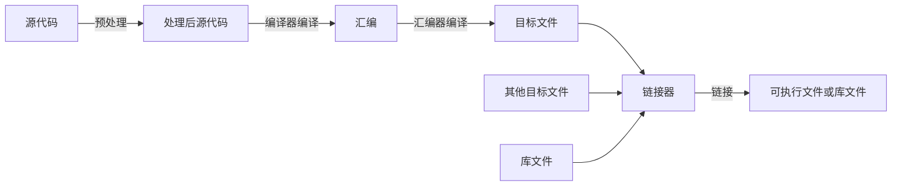

Pandoc是一个强大的文档转换工具，可以将Markdown文件转换为多种格式，包括PDF。结合Latex，我们可以生成高质量的PDF文档。本文将介绍如何使用Pandoc和Latex将Markdown转换为漂亮的PDF。

<!-- more -->

## 前言

Markdown是一种轻量级标记语言，广泛用于编写文档。通常情况下，我们阅读Markdown都是将其转换为网页使用浏览器来阅读，目前绝大多数Markdown阅读器都是采用此种方式。

当我们想要将Markdown文档保存为PDF文件时，如果通过转为HTML再打印为PDF，页面将会显得简陋，比如没有页眉页脚等，难以满足我们的要求。

而Latex是一个非常强大的排版系统，可以将tex文件编译成美观的的PDF文档，非常适合印刷物风格的文档。（当然Word也很好，但是惯用Word的人，大概直接就用Word写了吧。）

我们可以通过Pandoc将Markdown文档转换为latex格式，再使用Latex编译器将其编译成PDF文档。这样可以充分利用Latex的排版能力和Markdown的简洁，生成高质量的PDF文件。对于电脑上有Latex环境的人来说，这是很方便的。

我们可以通过Pandoc将Markdown转为latex再编译，也可以由pandoc自动完成转换和编译直接生成pdf。

如果觉得Pandoc的默认样式不够美观，Pandoc也支持自定义模板。如果要添加一些pandoc原生没有的功能，我们还可以自己编写过滤器，由pandoc调用，进行拓展。

下面将介绍Pandoc的基础用法以及模板Eisvogel的使用和调试。

## 安装Pandoc

要安装Pandoc，推荐到其[Github仓库](https://github.com/jgm/pandoc/releases)直接下载。大多数包管理器中都有pandoc但是版本可能较旧。

## Pandoc基础用法

pandoc命令行的基础命令如下：

```bash
pandoc [options] [input-file]...
```

options中常用的主要如下：

- `-f FORMAT, -r FORMAT  --from=FORMAT, --read=FORMAT` 指定输入格式FORMAT，如markdown，latex等
- `-t FORMAT, -w FORMAT  --to=FORMAT, --write=FORMAT` 指定输出格式FORMAT，如pdf，latex，docx等
- `-o FILE               --output=FILE`，指定输出文件名
- `-s[true|false]        --standalone[=true|false]` 指定是否生成独立的文档，若生成latex，为true时生成包含preamble，为false时没有。不加该选项则为false，加该选项默认值为true
- `--pdf-engine=PROGRAM` 生成pdf时指定要使用的engine，如果通过latex作为中间媒介，则选择latex的编译器，默认为`pdflatex`亦可选择使用`lualatex`，`xelatex`等
- `--number-sections` 生成的文档中是否自动编号章节，默认为false

例如如果我们有一个Markdown文件`example.md`，想要将其转换为PDF文件`example.pdf`，可以使用以下命令：

```bash
pandoc -f markdown -t pdf -o example.pdf --pdf-engine=lualatex example.md
```

## 使用Eisvogel模板

用于Pandoc的模板可以到网站[Pandoc-Templates](https://pandoc-templates.org/)上找，其中[Eisvogel](https://github.com/Wandmalfarbe/pandoc-latex-template)是一个非常流行的模板，提供了美观的排版和丰富的功能。

要使用模板，只需在Pandoc命令中加入参数`--template=FILE`，其中`FILE`是模板文件的路径。

或者，我们也可以将模板文件放到`~/.local/share/pandoc/templates`（Linux）或`~\AppData\Roaming\pandoc\templates`（Windows）文件夹中，Pandoc会默认在上面的文件夹中搜索模板文件。

Eisvogel模板提供了两个模板文件，一个`.latex`一个`.beamer`，我们要转换latex时使用`.latex`文件即可。

加上模板，上面的例子就变成了

```bash
pandoc -f markdown -t pdf -o example.pdf --pdf-engine=lualatex --template=eisvogel.latex example.md
```

Pandoc会通过指定的模板将Markdown文档转换为Latex文档再使用指定的pdf-engine将其编译为pdf。

### 设置字体

如果照着上面做，但是生成的PDF文件中所有中文字体都是方块，不用惊慌，这是正常的，因为我们没有设置中文字体，而默认的只有英文字体，这些字体中没有中文字符。

要解决这个问题，我们只需要在我们的Markdown文件的Front-matter中指定即可。比如我们要使用Google的Noto CJK系列字体，就可以在Markdown的开头（前面不要加任何东西）加入这几行：

```yaml
---
CJKmainfont: Noto Serif CJK SC
CJKsansfont: Noto Sans CJK SC
CJKmonofont: Noto Sans Mono CJK SC
---
```

这样在生成的latex文件中便会设置这些字体为相应的中文字体。其中`CJKmainfont`即中文正文字体，`CJKsansfont`即中文无衬线字体，常用于标题，`CJKmonofont`即中文等宽字体，一般用于一些代码块。

也可以通过此方法指定英文字体和数学字体

```yaml
mainfont: Libertinus Serif
sansfont: Libertinus Sans
monofont: Libertinus Mono
mathfont: Libertinus Math
```

### 其它设置

Eisvogel模板还创建了一些其它的变量，用于控制显示效果，比较常用的如下：

- `titlepage` 是否创建标题页，默认是`false`
- `toc-own-page` 是否将目录放在单独一页，默认是`false`
- `listings-no-page-break` 是否禁止在列表中分页，默认为`false`
- `header-left` 页眉左侧内容，默认为标题
- `header-center` 页眉中间内容，默认为空
- `header-right` 页眉右侧内容，默认为日期
- `footer-left` 页脚左侧内容，默认为作者
- `footer-center` 页脚中间内容，默认为空
- `footer-right` 页脚右侧内容，默认为页码

更具体的列表可以到Eisvogel的README中查看。

## 使用过滤器

Pandoc支持自定义过滤器。Pandoc的处理过程是先读取解析Markdown文件，生成一个抽象语法树（AST），然后将AST转换为目标格式的文档。我们可以编写过滤器处理AST对象并将其转换为处理后的AST对象或直接生成原始目标片段比如Latex代码。

要调用过滤器，只需在Pandoc命令中加入`--filter=PROGRAM`选项，其中`PROGRAM`是过滤器程序的路径，过滤器程序应为可直接执行的程序，比如脚本或二进制。Pandoc更鼓励使用lua语言来编写过滤器，其在与Pandoc一起工作时性能上更有优势，要调用lua过滤器，只需在Pandoc命令中加入`--lua-filter=SCRIPTPATH`或`-L SCRIPTPATH`选项，其中`SCRIPTPATH`是lua脚本的路径。

也可以将程序或脚本放在`/pandoc/filters`目录下，类似于上面的templates文件夹，该文件夹会被Pandoc默认搜索。

以下将推荐几个常用的过滤器。

### pandoc-crossref

pandoc-crossref是一个用于交叉引用的过滤器。原生的Pandoc和Markdown只支持使用链接来引用，无法进行自动编号等任务。而通过使用该过滤器，我们可以在Markdown文档中使用`{type:label}`的格式创建标记，再使用`@type:label`的格式来创建引用。在转换为latex时，pandoc-crossref会正确的将这些标记和引用转换为latex中合法的表达式并添加前缀。

比如对于图片可以这样写：

```plain
{#fig:label}

图 @fig:label 显示了一个图片
```

在最终生成的Latex文档中，`fig:label`会成为该图片的label，`@fig:label`会被转换为latex的引用语句`\ref{fig:label}`。Latex会为其自动编号。

> Pandoc默认所使用的Markdown是Pandoc拓展后的格式，表格前后如果有这样一行形似`Listing: Listing caption`或`: Listing caption`，那么`Listing caption`将会成为这个表格的caption。我们也可以将标记放在这一行。

如果要对section使用引用，必须令pandoc启用`--number-sections`参数，不然没有编号latex无法令引用生效。（在Latex中如果第一个标题不是一级标题，那么Latex会给其加一个前缀`0.`，如果我们希望使其变为`1.`，除了修改生成的latex之外可以在front-matter中添加`numberSections: true`，这样pandoc-crossref会自动处理这种情况，加一个隐式的一级标题。不过如果你想要`2.`，只能自己再将latex中的`1`改成`2`。）

Pandoc-crossref将引用转换为latex的引用时会自动加一个前缀，默认情况下前缀即类型名，比如`@fig:label`会变成`fig.~\ref{fig:label}`。如果我们想要更改这个前缀，可以通过在front-matter中设置相应的变量。

下面是一个示例文档，涉及了小节、公式、表格、代码块和图像的引用，并设置了字体和引用的前缀。

`````markdown
---
CJKmainfont: Noto Serif CJK SC
CJKmonofont: Noto Sans Mono CJK SC
CJKsansfont: Noto Sans CJK SC
mainfont: Libertinus Serif
mathfont: Libertinus Math
monofont: Libertinus Mono
sansfont: Libertinus Sans
codeBlockCaptions: true
secPrefix: 小节
tblPrefix: 表格
eqnPrefix: 公式
figPrefix: 图
lstPrefix: 列表
---

# 示例 {#sec:example}

@sec:equation 是一个示例小节，展示了如何在文档中使用公式、表格和代码块。

@sec:table 是一个示例小节，展示了如何在文档中使用表格。

@sec:code-block 是一个示例小节，展示了如何在文档中使用代码块。

## 公式 {#sec:equation}

$$
e = \lim_{x \to \infty} \left( 1 + \frac{1}{x} \right)^x
$$
{#eq:natural-number}

@eq:natural-number 是自然数e的定义。

## 表格 {#sec:table}

| Option | Explanation |
| :--- | :------ |
| `-L SCRIPTPATH` | 使用脚本`SCRIPTPATH` |
| `-F PROGRAM` | 使用程序`PROGRAM` |
: 过滤器相关参数 {#tbl:options}

@tbl:options 展示了与过滤器相关的参数。

## 代码块 {#sec:code-block}

有两种风格的代码块：一般风格和表格风格。

### 一般风格 {#sec:code-block-general-style}

```{#lst:c-hello-world .c caption="C Hello World"}
#include <stdio.h>

int main() {
    printf("Hello, world!");
    return 0;
}
```
@lst:c-hello-world 是C语言的一个简单示例。

> 注意：caption不能省略，否则无法生成正确的引用。

### 表格风格 {#sec:code-block-talbe-style}

在Markdown文档的front-matter中将`codeBlockCaptions`设为`true`可以允许下面的写法，即类似表格的写法：

```cpp
#include <iostream>

int main() {
    std::cout << "Hello, world!" << std::endl;
    return 0;
}
```
: C++ Hello World {#lst:hello-world}

@lst:hello-world 是C++版本的Hello World代码。

## 图 {#sec:figure}

{#fig:pandoc-logo}

@fig:pandoc-logo 是Pandoc一个流行的非官方的logo，[链接](https://github.com/tarleb/pandoc-logo)。
`````

以下是示例的渲染结果：


更具体的文档可以到pandoc-crossref的[官方文档](https://lierdakil.github.io/pandoc-crossref)中查看。

### diagram

现在很多Markdown解释器都支持在文档中插入Mermaid和Plantuml来绘制各种类型的图表。由于latex本身并不能渲染这些类型的图表，所以我们需要其他方法将这些图表放进latex中。

最简单的方法自然是先将图表渲染为图片，再插入文档中，之后便与一般图片无异。Pandoc已经有不少这一类的过滤器，这里介绍其中一个：[diagram](https://github.com/pandoc-ext/diagram).

该过滤器支持多种图表格式，包括Mermaid，Plantuml，TikZ，GraphViz，Asymptote和cetz。

它会将这些类型的代码块通过相对应的工具渲染之后将渲染结果插入原位置。

首先我们下载它的最新的release版本，将其中`diagram.lua`文件复制到filters文件夹下面即可。

这里主要介绍Mermaid。

在我之前的一篇文章[CMake基础教程](/ChillyBlog/2025/05/11/CMake基础教程)也曾画过一张简单的Mermaid流程图，这里以它为例：



首先，该过滤器本身并不执行写入文件，也就说生成的图片并不会被保存，如果生成的是latex，那么最终我们只会获得一个指向不存在文件的链接。所以我们必须在pandoc命令中添加一个参数`--extract-media=DIR`，其中`DIR`是图片被保存的文件夹。如果是HTML的话，则可以使用参数`--embed-resources`。（不过要html有大把的解释器可以直接保存HTML文件，你大概不会用pandoc）

其次，生成的图片的文件名默认是hash值，毫无辨识度，我们可以在文档中指定其将会生成的文件名。

最后，我们还可以在文档中指定图表的caption和label。如果我们想要将其和pandoc-crossref配合使用，那么我们可以将label指定为`fig:label`的格式，后面引用就与原本的没有区别。

这里根据上面的Mermaid流程图写一个示例：

`````markdown
---
CJKmainfont: Noto Serif CJK SC
CJKmonofont: Noto Sans Mono CJK SC
CJKsansfont: Noto Sans CJK SC
figPrefix: 图
mainfont: Libertinus Serif
mathfont: Libertinus Math
monofont: Libertinus Mono
sansfont: Libertinus Sans
---

# C/C++的编译过程 {#sec:cc-compilation-process}

C/C++的编译过程通常如下：

```{.mermaid filename="cc-compile-process-flowchart" caption="C/C++的编译流程图" #fig:cc-compile-process}
flowchart LR
    A[源代码] --> |预处理| B[处理后源代码]
    B --> |编译器编译| C[汇编]
    C --> |汇编器编译| D[目标文件]
    D --> E[链接器]
    F[其他目标文件] --> E
    G[库文件] --> E
    E --> |链接| H[可执行文件或库文件]
```

@fig:cc-compile-process 显示了C/C++的编译流程图。
`````

这里我们只能是会用一般风格来设置代码块的属性，因为diagram.lua的加入表格风格的写法会失效。这里`filename`的值即保存的文件名，`caption`用于设置caption，而label的设置则是直接使用了pandoc-crossref的写法，也可以使用`label`属性显示设置，最终的效果是一样的。

要对其引用，则就像之前一样使用`@fig:cc-compile-process`即可。

这是渲染效果图：


